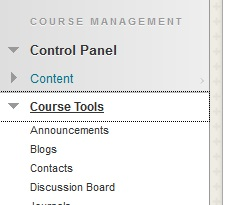
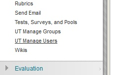
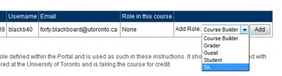

# Adding Your Teaching Assistants to your Course on Blackboard

You may wish to add Teaching Assistants to your Blackboard course. The system allows you to select a few role types, each of which have different levels of access.

## Too Add a Teaching Assistant:

Watch the video: https://www.youtube.com/watch?v=eX5yWhWMvJA

## To Add Course Staff:

Adding course staff to a course is the same process as adding a Teaching Assistant.

   * Go to **Control Panel**. Click on **Course Tools**. 
   
   * Select **UT Manage Users**. 
   
   * Enter the UTORid for the Teaching Assistant or course staff member and click **Go**. (Note: The UTORid should be obtained from the individual.) 
   
   * Each individual you add to your course will need an identified Role. From the **Add Role** drop down menu, choose a role (e.g. TA, Grader, etc.). Click **Add** and then click **OK**. 
   

## Roles in Blackboard.

There are a number of different roiles available in Blackboard. When adding someone to your course, you may choose from the following:

   * **Teaching Assistant:** A Teaching Assistant has access similar to that of an instructor. A TA can assist in creating and managing the Blackboard course (posting documents and announcements, moderating the discussion board, and so on). This role also provides the TA with access to the Grade Center allowing them to post or modify grades.
   * **Course Builder:** The Course Builder role can be assigned to individuals who are helping you to develop the course in Blackboard but who do not need access to the Grade Center. Course Builders can edit course content but do not have access to the Grade Center; they cannot remove forums from the discussion board.  
   * **Grader:** You may select this role for TAs whose primary responsibility within the course is grading or for individuals who are providing administrative support for the course. Graders have the ability to add or edit information in the Grade Center. The Grader cannot add or change course content.  
   * **Guest:** Visiting Instructors, special guests, peers and colleagues (with UTORids) can be enrolled by the Instructor of the course using this tool. For information on adding individuals without UTORids, please see: http://www.utorauth.utoronto.ca/?page=ltguest and http://www.utorauth.utoronto.ca/?page=others

One role option avaialble is **student**. Below are some important considerations when using the Student role:

   * **Students must enroll in courses through ROSI (the official student record system) in order to receive academic credit.** Students enrolled in your course through ROSI will appear on your class list in Blackboard. This tool must not be used to manually add students who have registered, or will be registering, in your course through ROSI.  Student information in Blackboard is updated every business day.
   * **This tool can be used to add individuals who are not officially enrolled in the course through ROSI (e.g. auditors, students writing deferred exams)**. Students must understand that being manually enrolled in Blackboard is not equivalent to being enrolled in the course.

EOF
