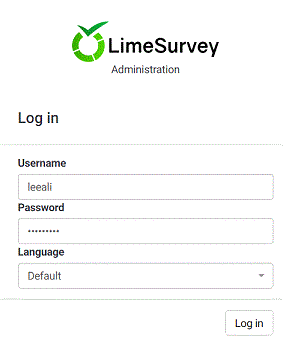
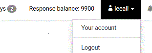
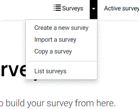

# Nursing Surveys (LimeSurvey)

The Faculty of Nursing now has a survey tool with more funtionality than the built-in blackboard survey functionality included with your courses. If you are interested in accessing this tool you will first need to request an account.

You can use this tool to create anonymous surveys, and have access to advanced features such as survey logic and branching.

An example use of this tool could be gathering mid-term feedback from students.

## Request an Account

To request an account at surveys.nursing.utoronto.ca please contact: it.nursing@utoronto.ca

## Logging In

Logging in: Go to https://surveys.nursing.utoronto.ca/admin/authentication/sa/login

Sign in using your username and the auto generated password sent to you.

A link to a Quick Introduction for LimeSurvey: https://manual.limesurvey.org/General_FAQ#I_need_a_quick_introduction_for_LimeSurvey

## Changing Your Password

Once you've logged in we recommend updating your password. To do this follow the steps listed below:

   1. Go to Your Account (click on your user name in the top right corner).
    
   2. Enter your new password in the Password field.
    
   3. Enter it again in the Repeat Password field
   4. Click Save (or Save and Close)

## Creating Surveys and Questions
To see already created surveys, click on the List surveys box.

To create a new survey, click on the Create Survey box

### Create a Survey
#### Creating a New Survey

   1. After clicking on the Create Survey box, enter in a survey title and Description (if 			needed), a Welcome Message (if needed) and an End message (if needed). All of 			these can be entered later (except for the survey title).
   2.  On the right side of the page, there are a number of options that can be adjusted 			as needed at a later date.
   3. Add details of these options later (or somewhere else and link to it??)
   4. On the Top Right of the screen, save your new survey by clicking on Save or Save 			and close

#### Creating a New Survey Using Import
   1. On the Top Left side of the page, click on ‘Import’
   2. Click the Choose File button and import the file.

   

   3. Please read more about this feature here: 						https://manual.limesurvey.org/Importing_a_survey_structure

### Create Question Groups
   1. Click on the Create a Group Button, then enter a Title and Description (if needed) and 	Click Save and Close.

### Create Questions
   1. Click on the Add new question to group button
   2. Enter question code
   3. On the Right Side of the page, choose the question type, make the question mandatory 	(or not) and any of the other options available to you.
   4. Enter the question text in the Question: box on the Left Side of the page
   5. On the Top Right, click Save, or Save and Close
   6. Information regarding that various question types can be found here: 		https://manual.limesurvey.org/Question_types

### Create Sub-questions
Some questions require *sub-questions* to add the various answer choices (i.e. Multiple Choice Questions)
   1. After saving and closing the question, in the Question Summary, 	choose Edit subquestions on the Top Menu Bar
   2. Enter the number of subquestions required and click Save and Close (or just Save)

## FAQ
This link gives some General Information on many aspects of LimeSurvey.
Look here first: https://manual.limesurvey.org/General_FAQ

The LimeSurvey Online Manual is available here: https://manual.limesurvey.org/

NOTE:

NEED IMAGES and Screenshots.
