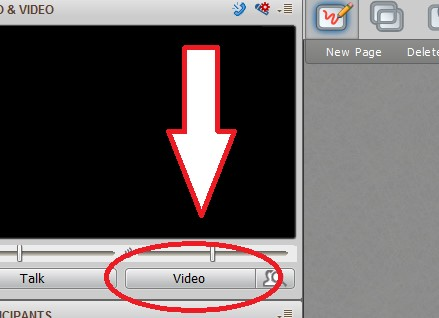
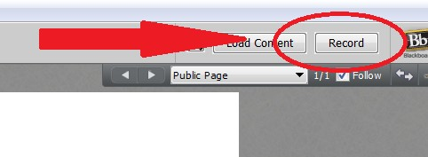

# Webinars

Webinars can be delivered using the Blackboard Collaborate Tool accessible from your Blackboard Course. This tool is designed to provide synchronous video, audio, and slide sharing to a group of students. In addition, the webinar is able to be recorded to allow for asynchronous viewing and archiving in your course.

## Before the Webinar - A Checklist of Things To Consider

&#x2610;&nbsp;  Schedule Webinar in blackboard, if you don’t know how, contact Neal/Allison

&#x2610;&nbsp; Book webinar room (if needed)

&#x2610;&nbsp;  Familiarize yourself with Blackboard Collaborate. If you don’t know the software, contact Neal/Allison for assistance

### When Setting up your Webinar

#### If presenter has a UTORid  
&nbsp;&nbsp;&nbsp;&nbsp;&nbsp;&nbsp;&#x2610;&nbsp; add speaker to course with UTORid and make speaker a moderator in the webinar

&nbsp;&nbsp;&nbsp;&nbsp;&nbsp;&nbsp;&#x2610;&nbsp; if speaker is new to bb collaborate, ensure Neal/Allison set up time to meet with speaker to discuss webinar software & download/install BB collaberate launcher

#### If presenter does not have a UTORid  
&nbsp;&nbsp;&nbsp;&nbsp;&nbsp;&nbsp;&#x2610;&nbsp; ensure Neal/Allison set up time to meet with speaker to show webinar software, download/install launcher

&nbsp;&nbsp;&nbsp;&nbsp;&nbsp;&nbsp;&#x2610;&nbsp; ensure you know how to make speaker with UTORId a moderator after signing in with guest link

#### Considerations

&#x2610;&nbsp; Ensure the appropriate people (other instructors etc.) have moderator access if needed

&#x2610;&nbsp; Ensure speaker is aware the only **.ppt** or **.pptx** files can be used in BB collaborate

&#x2610;&nbsp; When uploading the presentation, ensure the PowerPoint is closed. Note uploading take a bit of time, be patient

&#x2610;&nbsp; Ensure speaker is aware videos in presentations are problematic. Please discuss with Neal or Allison

&#x2610;&nbsp; Ensure you’re aware how to make the presenter a moderator (if needed)

### During the Webinar

&#x2610;&nbsp; Sign in early. Webinar defaults to open 15 minutes before the start of the webinar, but often is set to open 30 minute before.

&#x2610;&nbsp; Check that your mic and webcam is working by clicking on the Talk and Video buttons.

&#x2610;&nbsp; Upload the speakers PowerPoint presentation

&#x2610;&nbsp; Before starting remember to click Talk, Video and Record

---

## How to Set up the Webinar

Go to your course and click on Webinar, click on Schedule a Session. This will open a window for you to input the details.

Enter webinar name then enter the date and time for both the start and finish of the session. Choose how early you want the webinar to open before the start (default is 15 minutes).

Choose Course (will only be available to your section or Shared with other sections)

**If shared**, choose the Shared radio button
	In the box that appears, find the other sections you want to share in the webinar and add to the 	box.

**If not shared**, leave the default.   

Generally, leave the rest of the options as default, but if you have any questions, ask Neal / Allison

Click on the Add Moderator to add anyone in the course\* as a moderator to the webinar.  

\*If the person is not currently in the course, they should be added using UT Manage Users before trying to add them to the webinar

Click SAVE to save the webinar settings.

## Beginning your Webinar

To run a webinar, the Blackboard Collaborate Launcher must be downloaded and installed. After installing the launcher, click on the webinar name when the webinar is open.  The webinar is available when this symbol  appears beside the webinar name. Then click on the ‘Join Room’ button and a file called meeting.collab with download. If it doesn’t open automatically, open this file to start the webinar.

Speakers with a valid and active UTORid should be added to the course by the instructor and set up with moderator privileges in the webinar settings before the start of the session.

If the speaker has no valid UTORid, they should sign into the webinar using the guest URL and then the moderator in the course can make the speaker a moderator to run the webinar.

Check your microphone by clicking on the 'Talk' button.

*fig. 1 - Talk Button in the Webinar Interface*

Check your video (if needed) by clicking on the 'Video' button.

*fig. 2 - Video Button in the Webinar Interface*

When ready to start the webinar, turn click on the ‘Talk’ button, then the ‘Video’ button and finally click on the 'Record' button (top right)

*fig. 3 - Record Button in the Webinar Interface*

### Slides

Presentations must be PowerPoint files. PDF files will not upload. Please ensure that the PowerPoint program is CLOSED before you upload your presentation in the collaboration software.

PowerPoint animations will not play in Blackboard Collaborate. The software essentially takes an image of the PowerPoint slides when uploading them so no animations will work. The images and everything else will be static only.

Videos will not stream in the PowerPoint presentation.

It is possible to play video during a presentation, however it must be played separately from the presentation and cannot be streamed. People watching remotely should be given a URL (it’s possible to do this via the webinar chat) so that can play the video at the same time as it is being played 'live', but will be separate from webinar and not seen by webinar users through the webinar software.

### Uploading Powerpoint Files

After signing in as a moderator, on the top right there is a 'Load Content' button.

*fig. 4 - Load Content Button in the Webinar Interface*

Ensure your PowerPoint software is closed. Click the ‘Load Content’ button, choose your PowerPoint slides and choose 'open’. The program will then open, convert and upload the slides to the webinar software. Please be patient as this can take a few minutes.

Don't forget to click on the ‘Record’ button to record the session before you begin.

To move from slide to slide during your presentation, click on the arrow buttons.

*fig. 5 - Slide Naviagtion Buttons in the Webinar Interface*

If you want to jump to a slide, click on the down arrow beside the name of your first slide and choose from the listing.

*fig. 6 - 'Jump To'  Naviagtion Dropdown Menu in the Webinar Interface*
